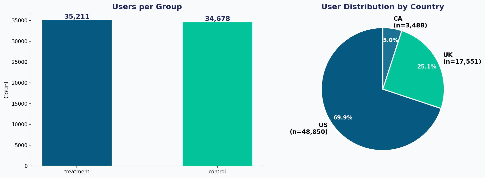
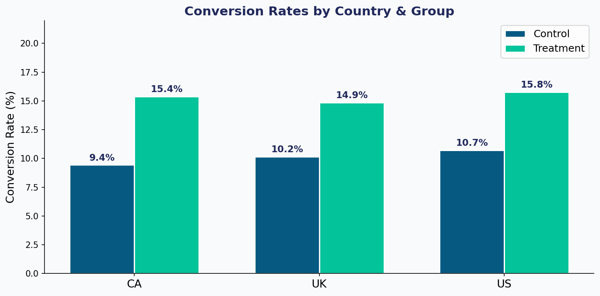
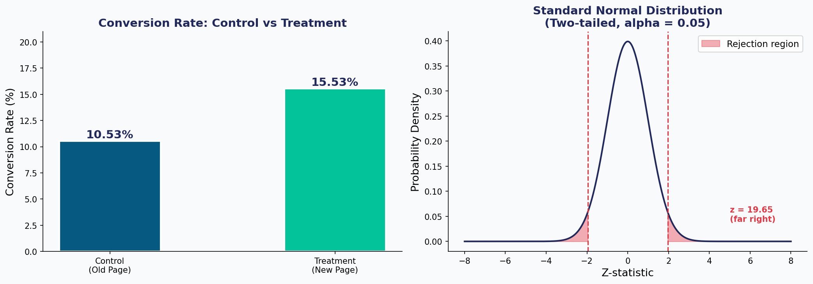

# 📊 Analyze A/B Test Results — Udacity Data Analyst Nanodegree

> A full end-to-end A/B test analysis for an e-commerce company evaluating whether a new web page increases user conversion rates.

---

## 📁 Project Structure

```
ab-test-project/
├── data/
│   └── ab_data.csv                   # Raw A/B test dataset (69,889 rows)
├── notebooks/
│   └── Analyze_AB_Test_Results.ipynb # Main analysis notebook
├── presentation/
│   └── AB_Test_Results.pptx          # Completed presentation deck
├── images/
│   ├── eda_distribution.png          # EDA: group & country distribution
│   ├── conversion_by_country.png     # Conversion rates by country & group
│   └── ab_test_results.png           # A/B test chart + z-distribution
├── results/
│   └── summary.md                    # Key results summary
└── README.md
```

---

## 🎯 Project Objective

An e-commerce website ran an A/B test to evaluate whether a **new web page** (treatment) leads to more user conversions than the **old page** (control). The goal is to determine:

- Should the company implement the new page?
- Keep the old page?
- Or run the experiment longer?

---

## 📊 Dataset

| Field | Description |
|-------|-------------|
| `country` | User's country: `US`, `UK`, or `CA` |
| `group` | Experimental group: `control` or `treatment` |
| `converted` | Whether the user converted: `1` = yes, `0` = no |

**Dataset statistics:**
- Total rows: **69,889**
- Control group: **34,678** users
- Treatment group: **35,211** users
- Countries: US (69.9%), UK (25.1%), CA (5.0%)

---

## 🔬 Analysis Overview

### Part I — Probability
Computed baseline conversion rates per group:
- **Control (old page): 10.53%**
- **Treatment (new page): 15.53%**
- **Δ = +5.01 percentage points**

### Part II — A/B Hypothesis Test

**Hypotheses (two-tailed):**
- **H₀:** p_treatment ≤ p_control (new page is not better)
- **H₁:** p_treatment > p_control (new page is better)
- **α = 0.05**

| Metric | Value |
|--------|-------|
| Z-statistic | **19.65** |
| P-value | **< 0.0001** |
| 95% CI for Δ | **(+4.51pp, +5.51pp)** |
| Reject H₀? | ✅ **YES** |

**Chi-Squared verification:**
- χ² = 385.57, p < 0.0001 — consistent with z-test

### Subgroup Analysis (by Country)

| Country | Control CR | Treatment CR | Δ | p-value |
|---------|-----------|-------------|---|---------|
| US | 10.73% | 15.78% | +5.05 pp | < 0.0001 |
| UK | 10.16% | 14.87% | +4.71 pp | < 0.0001 |
| CA | 9.45%  | 15.40% | +5.95 pp | < 0.0001 |

Treatment outperforms control **in every country**.

### Part III — Logistic Regression (Bonus)

Logistic regression with `group` and `country` as predictors confirms:
- Treatment group has a **significantly positive** coefficient (odds ratio > 1)
- Country effects are modest and do not confound the treatment effect
- The treatment lift is robust and independent of geography

---

## 📈 Key Visualizations

### EDA — Distribution


### Conversion Rates by Country


### A/B Test Results


---

## ✅ Conclusion & Recommendation

> **The new web page (treatment) significantly outperforms the old page across all countries and the overall user base.**

- The z-test yields z = 19.65, p < 0.0001 — overwhelming statistical evidence
- The effect is consistent across US, UK, and CA (no country-level confounding)
- The 95% CI lower bound (+4.51 pp) is practically significant
- **Recommendation: Implement the new page company-wide**

---

## 🛠️ Technologies Used

- **Python 3** — core analysis language
- **pandas** — data wrangling and groupby aggregations
- **NumPy** — numerical computations
- **SciPy** — z-test, chi-squared test, statistical distributions
- **Matplotlib / Seaborn** — data visualization
- **Jupyter Notebook** — interactive analysis environment
- **python-pptx** — presentation generation

---

## 🚀 Getting Started

```bash
# Clone the repository
git clone https://github.com/yourusername/ab-test-project.git
cd ab-test-project

# Install dependencies
pip install -r requirements.txt

# Launch notebook
jupyter notebook notebooks/Analyze_AB_Test_Results.ipynb
```

---

## 📋 Requirements

See `requirements.txt` for the full list of dependencies.

---

## 📄 License

This project is submitted as part of the **Udacity Data Analyst Nanodegree** program.
Dataset and presentation template © 2024 Udacity.
